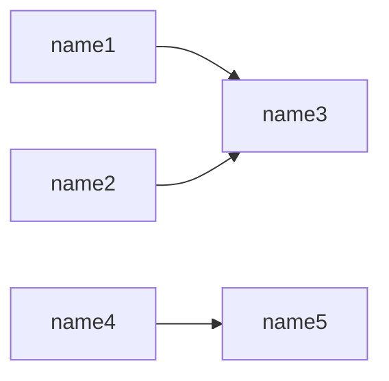
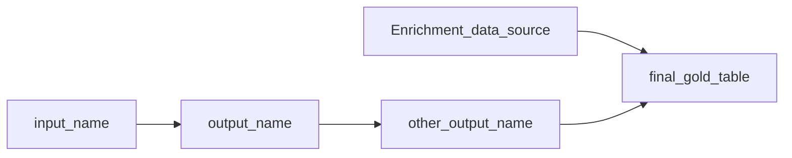

# Overview 



### do_something
**INPUTS:**
    - name1
    - name2

 certainly does something 

#### Code
```python
    @transform(
        someclass,
        Input('name1','dbfs://location1') 
        +  Input('name2','dbfs://location2') 
        >> Output('name3','dbfss://location3')    
    )
    def do_something(self,**context):
        """ certainly does something """
        print(context['name1'].location)

```

### do_something_else
**INPUTS:**
    - name4

 takes in some adls stuff and transforms it  

#### Code
```python
    @transform(
        someclass,
        Input('name4','dbfss://location_nowhere')
        >> Output('name5','dbfss://location_somewhere')
    )
    def do_something_else(self,**context):
        """ takes in some adls stuff and transforms it  """
        print(context)

```


# something Overview 
None



### bronze_to_silver
**INPUTS:**
    - output_name


        This method is to transform the Bronze Alchemy layer into the Silver Alchemy layer

        Args: 
            None

        Returns: 
            None
        

#### Code
```python
    @transform(
      Input('output_name','<adls path>')
      >> Output('other_output_name','<adls path>')
    )
    def bronze_to_silver(**context) -> None:
        """
        This method is to transform the Bronze Alchemy layer into the Silver Alchemy layer

        Args: 
            None

        Returns: 
            None
        """
        self.logger.info(f"Bronze data transformed and written to {self.silver_path}")

```

### silver_to_gold
**INPUTS:**
    - Enrichment_data_source
    - other_output_name

 

#### Code
```python
    @transform(
      Input('Enrichment_data_source','<adls path>')
      + Input('other_output_name','<adls_path>')
      >> Output('final_gold_table','<adls_path>')
    )
    def silver_to_gold(**context) -> None:
        """ """
        self.logger.info(f"{context}")

```

### source_to_bronze
**INPUTS:**
    - input_name


        This method is designed to bring in data from an external source to the Bronze Alchemy layer

        access input and output objects through context i.e. 
        >>> context["<input name>"].location 
        --> "<adls path>"
        
        Args:
            None
            
        Returns: 
            None
        

#### Code
```python
    @transform(
        Input('input_name', '<adls path>')
        # + <other input objects>
        >> Output('output_name', '<adls path>')
    )
    def source_to_bronze(**context) -> None:
        """
        This method is designed to bring in data from an external source to the Bronze Alchemy layer

        access input and output objects through context i.e. 
        >>> context["<input name>"].location 
        --> "<adls path>"
        
        Args:
            None
            
        Returns: 
            None
        """
        self.logger.info(f"Source data written to {self.bronze_path}")

```


```sql
STORE_RECORD_ID DECIMAL(10,0) COMMENT 'Primary key for a account'
    , PLACEKEY VARCHAR() COMMENT 'Source-agnostic mapping key for an account from the Placekey API'
    , ERROR_CD VARCHAR() COMMENT 'Null if vpid could be mapped to a placekey_id, otherwise shows the error message from the API'
    , EDW_START_TSP TIMESTAMP_NTZ(9) COMMENT 'Modified timestamp'
```
