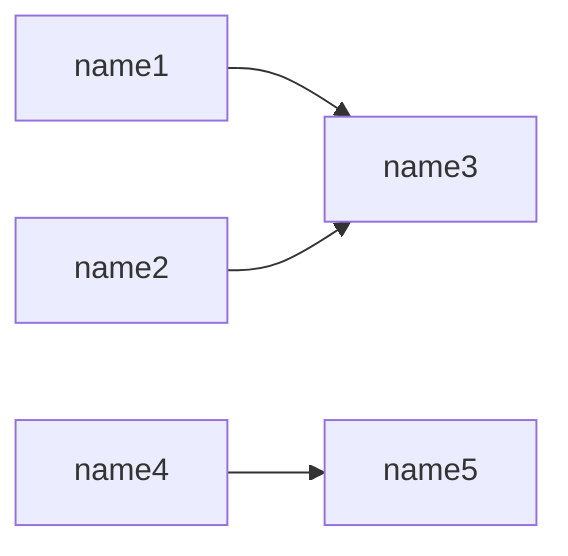

# Overview 



### do_something
**INPUTS:**
    - name1
    - name2

 certainly does something 

#### Code
```python
    @transform(
        someclass,
        Input('name1','dbfs://location1') 
        +  Input('name2','dbfs://location2') 
        >> Output('name3','dbfss://location3')    
    )
    def do_something(self,**context):
        """ certainly does something """
        print(context['name1'].location)

```

### do_something_else
**INPUTS:**
    - name4

 takes in some adls stuff and transforms it  

#### Code
```python
    @transform(
        someclass,
        Input('name4','dbfss://location_nowhere')
        >> Output('name5','dbfss://location_somewhere')
    )
    def do_something_else(self,**context):
        """ takes in some adls stuff and transforms it  """
        print(context)

```
