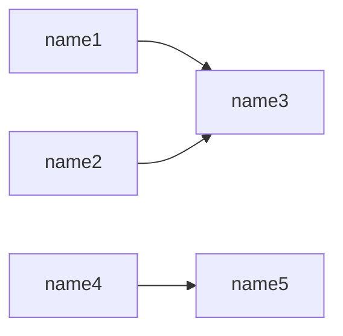

# Overview 

```mermaid
flowchart LR

    name1 & name2 --> name3
    name4 --> name5
```

### do_something
**INPUTS:**
  - name1
  - name2

 certainly does something 

### do_something_else
**INPUTS:**
  - name4

 takes in some adls stuff and transforms it  
